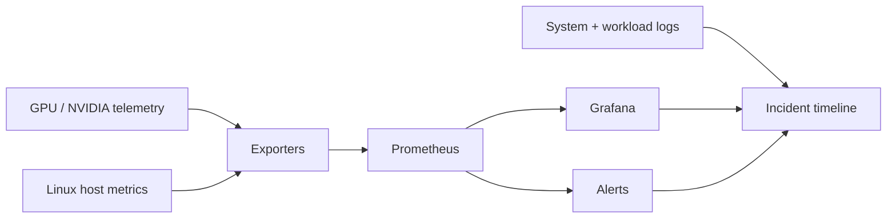

# Blackbox-GPU

> **The training run is dead. The only witness is telemetry. Reconstruct what happened.**

## Project status

| Field | Current state |
|---|---|
| **Status** | **Planned — baseline begins during GPU diagnostics; main campaign later** |
| **Current stage** | Campaign authored; no telemetry baseline, dashboard, or incident reconstruction is claimed yet |
| **Lab environment** | Local GPU telemetry where supported plus Linux host metrics; unsupported GPU fault classes use labeled reference/synthetic evidence |
| **Evidence rule** | Never manufacture real Xid/ECC/thermal failures; simulated or reference traces must be labeled clearly |
| **Last plan sync** | 2026-08-19 |
| **License** | No open-source license is granted unless an explicit license is added later |

## Skills you will build

- GPU telemetry and health monitoring
- `nvidia-smi` and NVIDIA management concepts
- DCGM / DCGM Exporter concepts where supported
- Prometheus metrics, exporters, labels, and PromQL
- Grafana dashboards and alerting
- Linux logs, service logs, and time correlation
- GPU utilization, temperature, power, clocks, memory, and error reasoning
- Xid/ECC concepts and hardware-vs-software fault triage
- Baselines, anomaly detection, and leading vs lagging indicators
- Incident timelines, root-cause analysis, and evidence-based postmortems

## General idea

Blackbox-GPU is an **observability and incident-forensics lab**.

A fictional overnight AI training job called **Nightjar** failed after hours of apparently normal operation. By the time anyone noticed, the workload had exited and the immediate symptoms were gone.

There is no one left to ask what happened.

There are only metrics, logs, timestamps, and whatever monitoring you had the foresight to collect.

Your job is to turn the environment into a **flight recorder for GPU infrastructure**, deliberately create failures and degradations, and then reconstruct each event from telemetry without relying on memory of what you broke.

The central question is:

> **Can I prove what happened after the failure is already over?**

---

# Incident Nightjar

At 02:13, a long-running training workload stopped making progress.

At 02:27, someone restarted it.

At 08:00, the team asks why it failed.

The first investigation finds conflicting clues:

```text
GPU utilization fell.
Temperature changed.
A service restarted.
CPU load spiked.
There may have been a GPU error.
The application log ends abruptly.
```

Which signal was the cause?
Which was a consequence?
Which was irrelevant?

Blackbox-GPU exists to make those distinctions visible.

---

## Flight-recorder architecture



The exact tools can evolve with the hardware available. The point is to build a chain from **physical/host behavior → measurements → storage → visualization → investigation**.

---

## Investigation campaign

| Flight | Incident | Skill focus | Black-box question |
|---|---|---|---|
| 00 | **Build the Recorder** | metrics pipeline | what must be captured before failure? |
| 01 | **Normal Flight** | baseline behavior | what does healthy actually look like? |
| 02 | **Heat Rising** | temperature, clocks, power | can you identify thermal behavior? |
| 03 | **The Idle GPU Mystery** | utilization, CPU/I/O bottlenecks | why is an expensive GPU waiting? |
| 04 | **Memory Pressure** | GPU/host memory signals | what does resource exhaustion look like? |
| 05 | **The Vanishing Process** | process/service logs | did the GPU fail or did software die? |
| 06 | **Signal in the Noise** | labels, dashboards, PromQL | which metrics actually matter? |
| 07 | **Alert Too Late** | alert design | can you detect the problem before the user reports it? |
| 08 | **Cross-Layer Collision** | host + GPU + app correlation | which layer failed first? |
| 09 | **Unknown Sabotage** | blind incident analysis | infer the injected fault from telemetry only |
| FINAL | **Nightjar Reconstruction** | full RCA | produce a defensible failure timeline |

---

## The black-box rule

For major incidents, the person analyzing the evidence should eventually be able to work from the telemetry without knowing the injected fault in advance.

Every reconstruction should separate:

```text
OBSERVATION   → something measured
INFERENCE     → what that measurement suggests
HYPOTHESIS    → a testable explanation
EVIDENCE      → what confirms or rejects it
ROOT CAUSE    → the initiating failure
CONTRIBUTORS  → things that made it worse
```

This prevents a common failure mode in troubleshooting: deciding what happened first, then hunting only for evidence that agrees.

---

## Signals to learn

Depending on hardware and tooling support, investigate signals such as:

### GPU

- utilization
- memory utilization / allocation
- temperature
- power draw / power limit
- clocks
- throttling reasons
- PCIe behavior
- Xid events
- ECC concepts

### Host

- CPU utilization
- load
- memory pressure
- swap
- disk I/O
- network throughput/loss
- process state
- service restarts

### Workload

- throughput
- batch/job progress
- latency
- errors
- checkpoint timing
- exit codes

The important skill is correlating signals across layers rather than staring at a single dashboard.

---

## Incident format

Each saved incident should contain:

```text
Incident ID:
User-visible symptom:
Detection time:
First abnormal signal:
Timeline:
Relevant metrics:
Relevant logs:
Hypotheses considered:
Tests performed:
Root cause:
Contributing factors:
Recovery action:
Preventive alert / automation:
What telemetry was missing:
```

That final question—**what telemetry was missing?**—is part of the lab. Every incident should make the recorder better.

---

## Dashboard philosophy

A dashboard is not complete because it looks impressive.

Every panel should answer an operational question, for example:

```text
Is the GPU doing useful work?
Is it being thermally or power constrained?
Is memory becoming a bottleneck?
Did the host become unhealthy first?
Did the problem begin before the workload noticed?
Can I correlate this timestamp with a log event?
```

If a graph does not help answer a question, it may be decoration.

---

## Suggested repository structure

```text
Blackbox-GPU/
├── README.md
├── recorder/
├── prometheus/
├── grafana/
├── workloads/
├── incidents/
├── dashboards/
├── failure-scenarios/
├── timelines/
└── evidence/
```

---

## Completion standard

Blackbox-GPU is complete when someone can hand you an unfamiliar failure window and you can reconstruct a credible sequence such as:

```text
02:07  workload throughput begins falling
02:08  GPU utilization oscillates
02:09  host I/O latency rises sharply
02:10  checkpoint stalls
02:12  application watchdog fires
02:13  workload exits
```

…and support the explanation with actual evidence.

The project should demonstrate more than monitoring.

> **Monitoring tells you that the aircraft crashed. Observability helps you explain why.**
